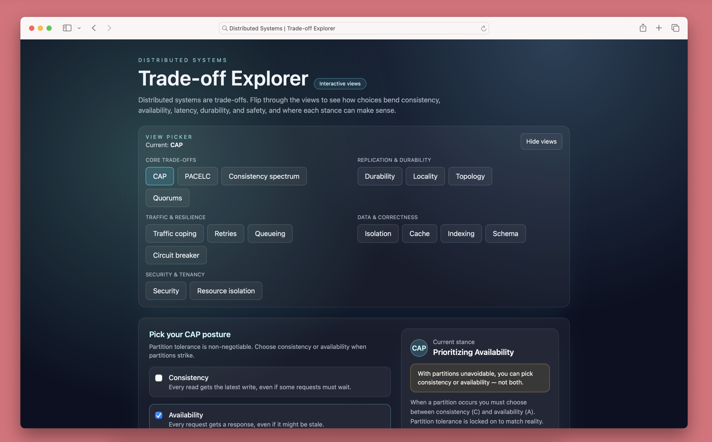
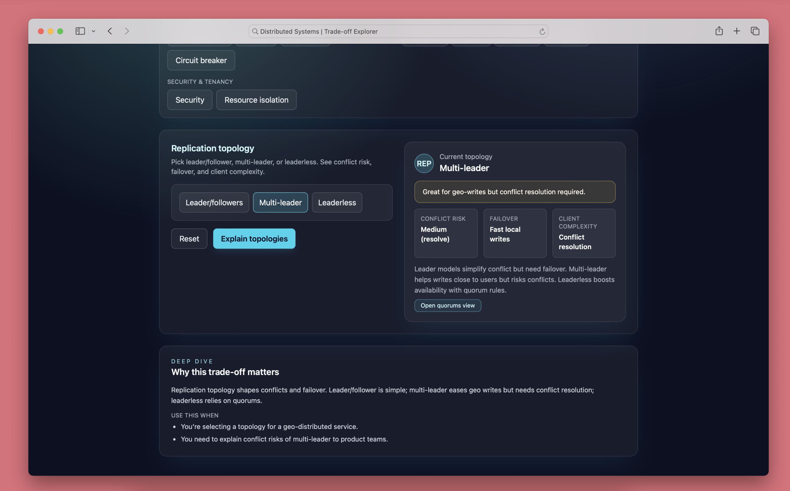

# Distributed Systems | Trade-off Explorer

An interactive, single-page explorer for common distributed-systems trade-offs. Views cover CAP, PACELC, consistency spectrum, quorums, traffic coping, durability, isolation, locality, topology, retries/jitter, queueing, caching, circuit breaking, indexing, schema evolution, security posture, and resource isolation. The goal is to help folks see how choices bend consistency, availability, latency, durability, and safety—and when each stance can make sense.

## Run locally
Open `index.html` in your browser. All styling/logic is bundled via Tailwind CDN, `styles.css`, and `script.js`—no build step or tooling required.

## Features
- **View picker** grouped by theme, collapsible, with hash-based memory for active view and picker visibility.
- **Interactive controls** per view (toggles, sliders, buttons) with inline messaging and current stance summaries.
- **Cross-links** between related views (e.g., topology → quorums) to follow dependencies and implications.
- **Deep dive** panel per view with context and “use this when” bullets to ground the choice.
- **Hash-based state** so refreshes keep your current view and picker open/closed state.

## Screenshots

## Notes and caveats
- Metrics (latency, risk, percentages) are illustrative heuristics for storytelling, not benchmarks.
- 

## Contributing
- Tweak heuristics, copy, or visuals as you see fit.
- No build tooling required; just edit `index.html`, `styles.css`, and `script.js`.
- PRs or notes on better heuristics and messaging are welcome.
